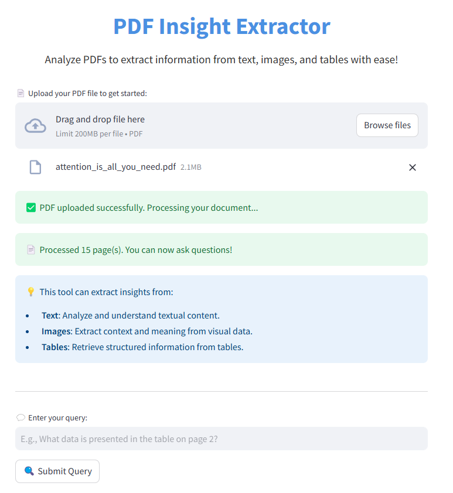

# PDF Insight Extractor

## Overview
The **PDF Insight Extractor** is a Streamlit-based web application designed to analyze PDF documents and extract insights from text, images, and tables. It utilizes the OpenAI GPT model to process multimodal inputs and generate accurate responses to user queries.

## Application


### Key Features
- 📄 Upload PDF files for processing.
- 🔍 Extract insights from:
  - **Text**: Understand and analyze textual content.
  - **Images**: Extract context and meaning from embedded visuals.
  - **Tables**: Retrieve structured data from tables.
- 💬 Ask questions about the document's content and get detailed responses.

---

## Installation

### Prerequisites
- Python 3.8 or above
- Pip for package management
- OpenAI API key (stored in a `.env` file)

### Steps
1. **Clone the Repository**
   ```bash
   git clone https://github.com/Harshita1195/pdf-insight-extractor.git
   cd pdf-insight-extractor
   ```

2. **Install Dependencies**
   ```bash
   pip install -r requirements.txt
   ```

3. **Set OpenAI API Key**
   - Create a `.env` file in the project directory.
   - Add the following line:
     ```
     OPENAI_API_KEY=your_openai_api_key
     ```

4. **Run the Application**
   ```bash
   streamlit run app.py
   ```

5. Open the provided local URL in your web browser.

---

## Usage

1. **Upload a PDF File**
   - Drag and drop or select a PDF file via the file uploader.

2. **Process the PDF**
   - The application converts each page into a base64-encoded image for analysis.

3. **Ask a Query**
   - Enter a query in natural language, such as:
     - "What data is presented in the table on page 2?"
     - "Summarize the text on page 1."
     - "Describe the image on page 3."
   - Click "Submit Query" to receive a detailed response.

---

## Code Details

### File: `app.py`
#### Core Functionalities
- **PDF to Image Conversion**:
  Converts PDF pages to base64-encoded images using the `fitz` library for processing with OpenAI's GPT model.
- **Query Handling**:
  Processes user queries using the LangChain OpenAI integration (`ChatOpenAI`).
- **Streamlit Interface**:
  - Provides an intuitive user interface for uploading PDFs and entering queries.
  - Highlights key capabilities for text, image, and table extraction.

---

## Dependencies
- **[Streamlit](https://streamlit.io/)**: For building the web interface.
- **[PyMuPDF (fitz)](https://pymupdf.readthedocs.io/)**: For PDF processing.
- **[Pillow](https://pillow.readthedocs.io/)**: For image handling.
- **[LangChain](https://www.langchain.com/)**: For OpenAI GPT model integration.
- **[dotenv](https://pypi.org/project/python-dotenv/)**: For environment variable management.

---

## License
This project is licensed under the MIT License. See the `LICENSE` file for details.